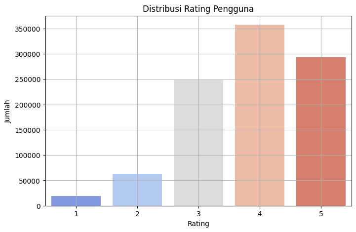
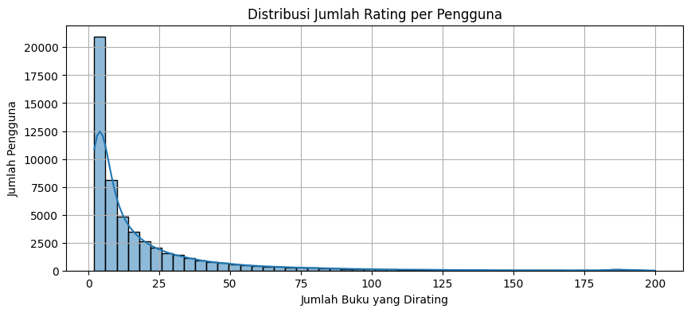
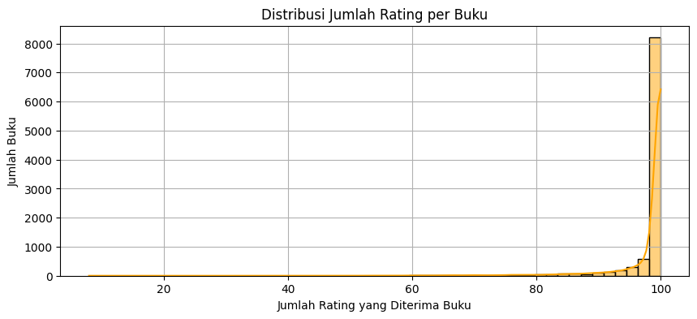

# Laporan Proyek Machine Learning - Mario Valerian Rante Ta'dung

## Project Overview

Perkembangan pesat teknologi digital telah menghadirkan ledakan informasi dan pilihan yang tak terbatas bagi pengguna, termasuk dalam hal pemilihan buku. Fenomena ini, yang sering disebut sebagai information overload, dapat menyulitkan pengguna dalam menemukan buku yang sesuai dengan minat dan preferensi mereka di antara jutaan judul yang tersedia. Oleh karena itu, dibutuhkan suatu sistem yang dapat menyajikan informasi yang paling relevan bagi pengguna, dan teknologi yang digunakan untuk itu adalah sistem rekomendasi. Sistem rekomendasi pada dasarnya mempermudah pengguna dalam menemukan berbagai jenis konten atau layanan mulai dari buku hingga situs web, dengan menganalisis dan menyatukan masukan, termasuk ulasan dari pengguna lain maupun sumber terpercaya [1]. Dengan menganalisis data historis interaksi pengguna-item, SR bertujuan untuk memprediksi preferensi pengguna dan merekomendasikan item yang paling relevan, sehingga menjadi alat yang sangat penting dalam berbagai platform digital saat ini.

Dalam upaya membangun sistem rekomendasi buku yang efektif, penelitian ini akan memanfaatkan dataset goodbooks-10k yang kaya akan explicit feedback berupa rating pengguna terhadap buku. Untuk melakukan prediksi rating, akan diimplementasikan model Neural Matrix Factorization (NeuMF), sebuah kerangka kerja yang menggeneralisasi faktorisasi matriks dengan menggunakan jaringan saraf. NeuMF mampu menangkap interaksi non-linear yang kompleks antara pengguna dan item dengan menggabungkan kekuatan Generalized Matrix Factorization (GMF) untuk menangkap hubungan linear dan Multi-Layer Perceptron (MLP) untuk memodelkan interaksi non-linear [2]. Penerapan NeuMF pada dataset goodbooks-10k diharapkan dapat menghasilkan prediksi rating yang akurat, yang pada akhirnya bertujuan untuk membantu pengguna menemukan buku yang paling sesuai dengan selera mereka secara lebih efisien.

### **Referensi**

\[1] D. H. Park, H. K. Kim, I. Y. Choi, and J. K. Kim, “A literature review and classification of recommender systems research,” Expert Syst. Appl., vol. 39, no. 11, pp. 10059–10072, Aug. 2012. doi: 10.1016/j.eswa.2012.02.085.

\[2] X. He, L. Liao, H. Zhang, L. Nie, X. Hu, and T.-S. Chua, “Neural Collaborative Filtering,” in Proceedings of the 26th International Conference on World Wide Web, Perth, Australia, 2017, pp. 173–182. doi: 10.1145/3038912.3052569.


## Business Understanding

Pada bagian ini, Anda perlu menjelaskan proses klarifikasi masalah.

Bagian laporan ini mencakup:

### Problem Statements

Menjelaskan pernyataan masalah:
- Pernyataan Masalah 1
- Pernyataan Masalah 2
- Pernyataan Masalah n

### Goals

Menjelaskan tujuan proyek yang menjawab pernyataan masalah:
- Jawaban pernyataan masalah 1
- Jawaban pernyataan masalah 2
- Jawaban pernyataan masalah n

Semua poin di atas harus diuraikan dengan jelas. Anda bebas menuliskan berapa pernyataan masalah dan juga goals yang diinginkan.

**Rubrik/Kriteria Tambahan (Opsional)**:
- Menambahkan bagian “Solution Approach” yang menguraikan cara untuk meraih goals. Bagian ini dibuat dengan ketentuan sebagai berikut: 

    ### Solution statements
    - Mengajukan 2 atau lebih solution approach (algoritma atau pendekatan sistem rekomendasi).

## Data Understanding
Dataset yang digunakan dalam proyek ini adalah **Goodbooks-10K** ([Kaggle - Goodbooks-10k Dataset](https://www.kaggle.com/datasets/zygmunt/goodbooks-10k)). Secara keseluruhan, dataset ini terdiri dari beberapa file, yaitu:

* `books.csv`
* `ratings.csv`
* `books_tags.csv`
* `tags.csv`
* `to_read.csv`
* `sample_book.xml`

Namun, dalam proyek ini hanya dua file yang digunakan, yaitu **`ratings.csv`** dan **`books.csv`**, karena keduanya sudah cukup untuk membangun sistem rekomendasi berdasarkan interaksi pengguna dengan buku.

### 3.1 Deskripsi Dataset

#### a. Ratings

| No. | Kolom    | Tipe Data | Jumlah Non-Null | Deskripsi                                                              |
| --- | -------- | --------- | --------------- | ---------------------------------------------------------------------- |
| 1   | user\_id | int64     | 981,756         | ID pengguna yang memberikan rating pada buku                           |
| 2   | book\_id | int64     | 981,756         | ID buku yang diberi rating                                             |
| 3   | rating   | int64     | 981,756         | Nilai rating yang diberikan oleh pengguna terhadap buku (biasanya 1–5) |

#### b. Books
  
| No. | Kolom                       | Tipe Data | Jumlah Non-Null | Deskripsi                                                   |
| --- | --------------------------- | --------- | --------------- | ----------------------------------------------------------- |
| 1   | id                          | int64     | 10,000          | ID unik untuk setiap entri buku                             |
| 2   | book\_id                    | int64     | 10,000          | ID buku, kemungkinan digunakan untuk relasi antar tabel     |
| 3   | best\_book\_id              | int64     | 10,000          | ID dari versi terbaik buku (representatif satu buku)        |
| 4   | work\_id                    | int64     | 10,000          | ID karya umum (bisa terdiri dari banyak edisi)              |
| 5   | books\_count                | int64     | 10,000          | Jumlah edisi berbeda dari buku tersebut                     |
| 6   | isbn                        | object    | 9,300           | ISBN 10-digit dari buku                                     |
| 7   | isbn13                      | float64   | 9,415           | ISBN 13-digit dari buku                                     |
| 8   | authors                     | object    | 10,000          | Nama penulis buku                                           |
| 9   | original\_publication\_year | float64   | 9,979           | Tahun asli penerbitan pertama buku                          |
| 10  | original\_title             | object    | 9,415           | Judul asli dari buku (tanpa subtitle atau versi terjemahan) |
| 11  | title                       | object    | 10,000          | Judul yang ditampilkan di dataset                           |
| 12  | language\_code              | object    | 8,916           | Kode bahasa buku (misal: 'en', 'spa')                       |
| 13  | average\_rating             | float64   | 10,000          | Rata-rata rating dari semua pengguna Goodreads              |
| 14  | ratings\_count              | int64     | 10,000          | Jumlah total rating yang diterima buku                      |
| 15  | work\_ratings\_count        | int64     | 10,000          | Jumlah rating untuk seluruh edisi (berdasarkan `work_id`)   |
| 16  | work\_text\_reviews\_count  | int64     | 10,000          | Jumlah ulasan teks yang diberikan pengguna                  |
| 17  | ratings\_1                  | int64     | 10,000          | Jumlah rating bintang 1                                     |
| 18  | ratings\_2                  | int64     | 10,000          | Jumlah rating bintang 2                                     |
| 19  | ratings\_3                  | int64     | 10,000          | Jumlah rating bintang 3                                     |
| 20  | ratings\_4                  | int64     | 10,000          | Jumlah rating bintang 4                                     |
| 21  | ratings\_5                  | int64     | 10,000          | Jumlah rating bintang 5                                     |
| 22  | image\_url                  | object    | 10,000          | URL gambar sampul buku                                      |
| 23  | small\_image\_url           | object    | 10,000          | URL gambar sampul kecil (thumbnail)                         |

### 3.2 Distribusi Rating

- Berdasarkan grafik distribusi rating pengguna, terlihat bahwa mayoritas pengguna cenderung memberikan rating tinggi, dengan rating 4 menjadi yang paling banyak diberikan, disusul oleh rating 5. Sebaliknya, rating rendah seperti 1 dan 2 jarang diberikan, menunjukkan bahwa pengguna cenderung memiliki persepsi positif terhadap film yang mereka tonton. Rating 3 sebagai nilai tengah juga cukup banyak muncul, mencerminkan adanya penilaian netral. Distribusi ini bersifat positif atau condong ke arah rating tinggi, yang merupakan pola umum dalam data rating film. Pola ini penting untuk diperhatikan saat membangun sistem rekomendasi, karena kecenderungan pengguna memberikan rating tinggi dapat memengaruhi cara model dalam membedakan preferensi antar pengguna.

### 3.3 Rating Per-User

- Dari histogram “Distribusi Jumlah Rating per Pengguna” di atas, dapat dilihat bahwa mayoritas pengguna hanya memberi rating pada sejumlah kecil buku (misalnya 1–5 buku), di mana puncak tertinggi (sekitar 20.000 pengguna) berada pada bin paling kiri (pengguna yang memberi rating sangat rendah). Seiring meningkatnya jumlah buku yang dirating per pengguna, jumlah pengguna menurun drastis—misalnya hanya beberapa ribu pengguna yang merating sekitar 10–20 buku, dan semakin sedikit lagi (beberapa ratus atau puluhan saja) yang merating puluhan hingga ratusan buku. Kurva kepadatan mempertegas pola ini: sangat “menonjol” di nilai rendah dan kemudian memerah ke kanan dengan ekor panjang hingga sekitar 200 buku. Artinya, distribusi ini sangat miring ke kanan (right-skewed): sebagian besar pengguna bersifat “casual” dengan sedikit interaksi (sedikit memberi rating), sedangkan hanya segelintir “power user” yang banyak merating buku.

### 3.4 Rating Per-Book

- Dari histogram tersebut terlihat bahwa hampir seluruh buku dalam dataset mengumpulkan jumlah rating yang sangat tinggi—terkonsentrasi di kisaran 90–100—sementara sangat sedikit buku yang mendapat rating di bawah 50, sehingga distribusinya tampak sangat miring ke kanan; hal ini menandakan bahwa data kemungkinan hanya mencakup buku-buku populer yang sudah memiliki basis pembaca/rater besar, sehingga nilai rata‐rata jumlah rating per buku menjadi sangat dekat dengan batas atas (100).

### 3.4 Hitung Missing Value
| No. | Kolom                       | Jumlah Missing |
| --- | --------------------------- | -------------- |
| 1   | isbn                        | 700            |
| 2   | isbn13                      | 585            |
| 3   | original\_publication\_year | 21             |
| 4   | original\_title             | 585            |
| 5   | language\_code              | 1,084          |
- Masih terdapat beberapa detail tentang buku yang tidak lengkap. Namun hal ini tidak akan menjadi masalah karena fokus kita adalah melakukan Collaborative Filtering User-Based dengan fokus pada data rating saja.

## Data Preparation
### 4.1 Pemisahan Fitur dan Target
Pemisahan data fitur dan target untuk model rekomendasi, di mana X berisi pasangan pengguna dan buku, dan y berisi nilai rating. Proses ini diperlukan agar model dapat belajar memetakan input ke output secara jelas dan menghindari kebocoran data saat pelatihan.

```python
X = ratings[['user_id', 'book_id']].values
y = ratings['rating'].values
```
### 4.2 Train-Test Split
Distribusi rating tidak seimbang sehingga pembagian data train dan validasi dilakukan menggunakan StratifiedShuffleSplit agar proporsi rating pada kedua set tetap terjaga dengan rasio 80:20. Hal ini dilakukan agar distribusi rating yang tidak seimbang tetap terjaga di kedua set, sehingga model dapat belajar dan dievaluasi secara representatif tanpa bias terhadap kelas rating tertentu. 

```python
splitter = StratifiedShuffleSplit(n_splits=1, test_size=0.2, random_state=42)

for train_idx, val_idx in splitter.split(X, ratings['rating']):
    X_train, X_val = X[train_idx], X[val_idx]
    y_train, y_val = y[train_idx], y[val_idx]
```

## Modeling
Tahapan ini membahas mengenai model sisten rekomendasi yang Anda buat untuk menyelesaikan permasalahan. Sajikan top-N recommendation sebagai output.

**Rubrik/Kriteria Tambahan (Opsional)**: 
- Menyajikan dua solusi rekomendasi dengan algoritma yang berbeda.
- Menjelaskan kelebihan dan kekurangan dari solusi/pendekatan yang dipilih.

## Evaluation
Pada bagian ini Anda perlu menyebutkan metrik evaluasi yang digunakan. Kemudian, jelaskan hasil proyek berdasarkan metrik evaluasi tersebut.

Ingatlah, metrik evaluasi yang digunakan harus sesuai dengan konteks data, problem statement, dan solusi yang diinginkan.

**Rubrik/Kriteria Tambahan (Opsional)**: 
- Menjelaskan formula metrik dan bagaimana metrik tersebut bekerja.

**---Ini adalah bagian akhir laporan---**
